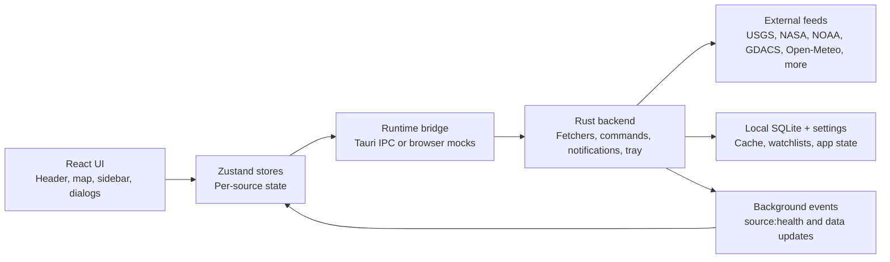

# EarthPulse System Overview

- Owner: Architecture Owner
- Last reviewed: 2026-03-13
- Release posture: internal unsigned beta by default

## Purpose

EarthPulse is a Tauri desktop app that shows live Earth and space activity on a global map. The app is designed for continuous desktop monitoring, with a browser preview mode used only for quick UI validation.

## Top-Level Architecture

## Major Runtime Modes

### Desktop mode

- Entry point: `pnpm tauri dev`
- Frontend calls real Tauri commands.
- Rust background tasks poll external feeds and emit update events.
- SQLite-backed settings, watchlists, notifications, tray, and exports are active.

### Browser preview mode

- Entry point: `pnpm dev`
- `src/runtime/browserMocks.ts` installs a mocked Tauri bridge.
- The preview is for UI and smoke checks only.
- Live upstream reliability, tray behavior, and native desktop integrations must be verified in desktop mode.

## Main Subsystems

| Subsystem                | Location                                                                          | Responsibility                                                                    |
| ------------------------ | --------------------------------------------------------------------------------- | --------------------------------------------------------------------------------- |
| App shell                | `src/App.tsx`                                                                     | Starts fetches, listener wiring, dialogs, and major layout regions                |
| Map experience           | `src/components/Map/`                                                             | Renders map tiles, overlays, and event layers                                     |
| Sidebar and controls     | `src/components/Sidebar/`, `src/components/Timeline/`, `src/components/Settings/` | Shows live panels, replay, historical mode, watchlists, and settings              |
| Client state             | `src/stores/`                                                                     | Holds per-source data, loading/error state, and user preferences                  |
| UI behavior              | `src/hooks/`, `src/utils/`, `src/audio/`                                          | Keyboard shortcuts, source health listeners, exports, notifications, sonification |
| Runtime boundary         | `src/runtime/`                                                                    | Chooses Tauri bridge or browser mock implementation                               |
| Backend services         | `src-tauri/src/`                                                                  | Fetchers, IPC commands, SQLite, notifications, tray, background polling           |
| Verification and release | `.codex/`, `.github/workflows/`, `scripts/`                                       | Deterministic verify flow, CI quality gates, release packaging                    |

## Startup Sequence

1. The frontend boots through `src/main.tsx`.
2. Runtime detection decides whether to use the real Tauri bridge or browser mocks.
3. `src/App.tsx` hydrates persisted settings and kicks off initial fetches.
4. Zustand stores attach event listeners for background updates.
5. In desktop mode, Rust background loops poll external sources and emit update events.
6. The UI renders map layers, sidebar panels, replay controls, and dialogs using live or degraded data.

## Operational Boundaries

- The frontend owns rendering, interaction flow, and user-visible state coverage.
- The Rust backend owns external fetches, background refresh cadence, notifications, tray behavior, and SQLite persistence.
- The command contract in `contracts/tauri-commands.json` is the shared boundary and must stay synchronized with frontend `invoke(...)` usage and Rust handler registration.

## Known Readiness Constraints

- Local workspaces must not live in a path containing `:`.
- Browser preview is not a substitute for desktop validation.
- Signed/notarized distribution is not complete until GitHub Actions secrets are provisioned and tested.

## How To Update This Doc

Update this doc when any of the following changes:

- a major UI region is added or removed
- a new backend service or persistence layer is introduced
- the runtime boundary changes
- the release posture changes from internal beta to signed distribution
